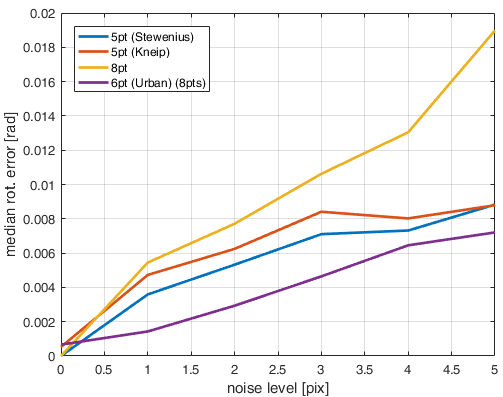

# This repository contains a fork of OpenGV
**Author**: [Steffen Urban](http://www.ipf.kit.edu/english/staff_urban_steffen.php) (urbste at googlemail.com).

## This fork contains three additional algorithms

- MLPnP - a central absolute pose solver
- a central relativ orientation solver (needs >= 6 pts) for small baselines, based on the ideas of MLPnP
- and the multi-camera motion algorithm by Jonathan Ventura [code](https://github.com/jonathanventura/multi-camera-motion)

I could not compile latter on Windows, but on Linux it should compile fine.
This is due to the the file approx_relpose_generalized_fast_computeA.cpp which the Microsoft compilter
won't compile.
If you like to compile this algorithm in Linux just uncomment the lines in this file.

For examples on how to use MLPnP and the relativ pose algorithm have a look at
the Matlab scripts.
Also have a look in the MLPnP repositories [MLPnP](https://github.com/urbste/MLPnP_matlab),[MLPnP\_toolbox](https://github.com/urbste/MLPnP_matlab_toolbox) that contain Matlab implementations.

## Results for MLPnP
These results can be reproduced by running benchmark_absolute\_pose\_cov.m

### mean and median rotation error

### mean and median position error

## Results of the 6pt relative rotation solver

These results can be reproduced by running benchmark\_relative\_pose.m .
Baseline is sampled up to 10cm.

